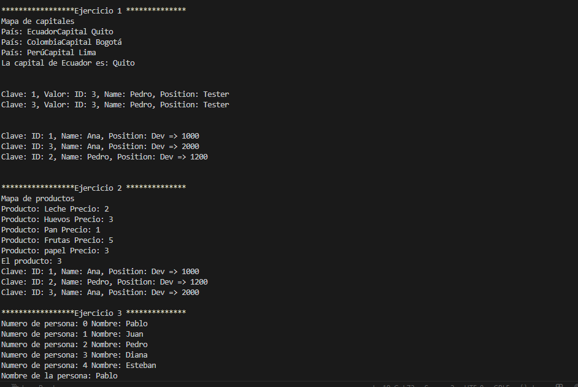
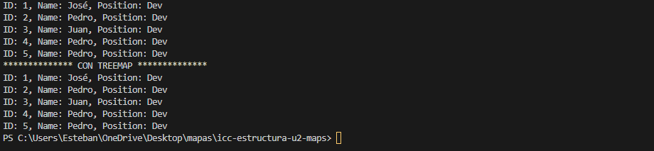

<<<<<<< HEAD
# Práctica de Algoritmos de Ordenamiento

## 📌 Información General

- **Título:** Práctica de Maps 
- **Asignatura:** Estructura de Datos
- **Carrera:** Computación
- **Estudiante:** Esteban Vicente Pesantez Rea
- **Fecha:** 08/07/2025
- **Profesor:** Ing. Pablo Torres

---

## 🛠️ Imagen de la práctica:

=======
# Práctica de Algoritmos de Ordenamiento

## 📌 Información General

- **Título:** Práctica de Maps 
- **Asignatura:** Estructura de Datos
- **Carrera:** Computación
- **Estudiante:** Esteban Vicente Pesantez Rea
- **Fecha:** 08/07/2025
- **Profesor:** Ing. Pablo Torres

---

## 🛠️ Imagen de la práctica:

>>>>>>> 9f7fea1 (ejercicios)
